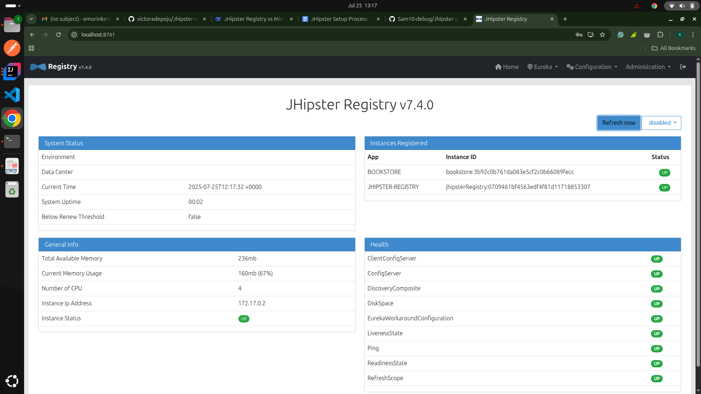

# Jhipster Microservice Setup
## Overview

This repository contains a JHipster-based microservices 
project consisting of a Gateway, a BookStore microservice, 
and a JHipster Registry. JHipster is a free and open-source application generator used to quickly develop modern web applications and Microservices using Angular or React and the Spring Framework. 
This README provides detailed instructions for setting up, 
developing, and testing the project, including how to interact with the BookService API through the Gateway using Postman.

## Project Structure
- registry: Service discovery and configuration management. (pulled from Docker)
- gateway: Reverse proxy and API gateway.
- book-app: A microservice that provides CRUD operations for managing books.

### Installing JHipster
To install JHipster, run the following command:


```bash 
   npm install -g generator-jhipster 
```

This will globally install the JHipster generator, allowing you to create JHipster projects using the command:

```bash 
  jhipster 
```

## Setup
### 1. Pull the JHipster registry from Docker
```bash
    docker pull jhipster/jhipster-registry
```
After pulling it from Docker, you start the image using ```docker start``` and you get access to the interface on ```https://localhost:8761```

### Gateway Application
```bash
   mkdir gateway
   cd gateway
   jhipster
```
   During the prompts, select the following options:

- What type of application would you like to create?: Gateway application
- What is your default Java package name: // your choice(com.emorinken.bookstore)
- Would you like to use Maven or Gradle for building the backend: Maven
- As you are running a microservices architecture, on which port would you like your server to run? It should be unique to avoid port conflict: 8080
- Which service discovery server do you want to use: JHipster Registry (legacy, uses Eureka, provides Spring Cloud Config support)
- Which type of authentication would you like to use?: JWT authentication (stateless, with a token)
- Which tyoe of database would you like to use: No database
- Development Database: No database
- Production Database: No database
- Which framework would you like to use for the client? No client
- Other options: Select according to your preference. 

### Book-App Microservice
```bash
  mkdir book-service
  cd book-service
  jhipster
```

During the prompts, select the following options:

- What type of application would you like to create?: Microservice application
- What is your default Java package name: // your choice(com.emorinken.bookstore)
- Would you like to use Maven or Gradle for building the backend: Maven
- Do you want to make it reactive with Spring WebFlux? No
- As you are running a microservices architecture, on which port would you like your server to run? It should be unique to avoid port conflict: 8081
- Which service discovery server do you want to use: JHipster Registry (legacy, uses Eureka, provides Spring Cloud Config support)
- Which type of authentication would you like to use?: JWT authentication (stateless, with a token)
- Do you want to generate a feign client? // your choice (Yes)
- Which tyoe of database would you like to use: SQL
- Production Database: Postgres
- Development Database: Postgres
- Which framework would you like to use for the client? No client
- Other options: Select according to your preference.

### 2. Configure PostgreSQL
   Launch your Docker desktop app, then run and start the PostgreSQL container:
```bash 

docker-compose -f src/main/docker/postgresql.yml up -d
```

### 3. Synchronize JWT Secrets
   Ensure the base64 secret in src/main/resources/config/application-dev.yml of both the Gateway and BookService is the same to prevent 401 Unauthorized errors.

## Development
### 1. Create the Book Entity
   Generate the Book entity in the BookService using JHipster:
```bash
  jhipster entity Book
```

Define the following fields:

- title: String, not null, unique
- author: String, not null
- price: BigDecimal, not null
- isbn: String, min, max,not null

Select the following prompts as it fits your preference. At the end, JHipster will generate the entity, relationship (if any, none in this case), repository, service, and resource (REST API controller), DTO, tests etc.


## Running the Applications
### 1. Make sure the JHipster Registry is running
   Remember, we pulled the JHipster registry from docker and started it using ```docker start```

Open ```http://localhost:8761 ```on your browser of choice and you should be redirected to the sign in page. The default username and password is admin:


After signing in, the interface of the JHipster registry should look like this:

And it is important to note that the only instance present is the JHipster itself

### 2. Run the Gateway Application


Check the registry again and see that this time, the gateway has been included as an instance


## 3. Run the BookApp Microservice


Check the registry again and see that this time, the bookapp microservice has also been included as an instance

## Testing the API with Postman
### 1. Obtain a JWT Token
   - Method: POST
   - URL: http://localhost:8080/api/authenticate
   - Headers:

```Content-Type```: ```application/json```

Body (JSON):
```bash
    {
    "username": "admin",
    "password": "admin"
    }
```

Response:

- Status: 200 OK
- Body: Contains JWT token:
```bash
  {
"id_token": "your_jwt_token_here"
} 
```
### 2. Create a New Book
   NOTE: the bookapp microservice is accessed from the gateway through ```/services/{microservice-name}/**```

hence, for my app it is ```/services/bookapp/**```

- Method: POST
- URL: ```http://localhost:8080/services/bookapp/api/books```
- Headers:

```Authorization```: ```Bearer <your_jwt_token>```

```Content-Type```: ```application/json```

Body (JSON):

```bash
    {
"title": "Chike and the river",
"authorName": "Chinua Achebe",
"price":679.35,
"isbn": "2672617188272bU"
}
```
Response:

```Status```: ```201 Created```

Body: Returns the created BookDTO.

### 3. Update an Existing Book
   - Method: PUT
   - URL: ```http://localhost:8080/services/bookapp/api/books/{id}```
   - Headers:

```Authorization```: ```Bearer <your_jwt_token>```

```Content-Type```: ```application/json```

Body (JSON):

```bash
    {
"id": 1,
"title": "Chike and the river pt2.",
"authorName": "Chinua Achebe II",
"price":908.78,
"isbn": "782719Ubnu"
}
```
Response:

```Status```: ```200 OK```

Body: Returns the updated BookDTO.

### 4. Partially Update a Book
   - Method: PATCH
   - URL: ```http://localhost:8080/services/bookapp/api/books/{id}```
   - Headers:

```Authorization```: ```Bearer <your_jwt_token>```

```Content-Type```: ```application/json```
Body (JSON):

```bash
    {
"id": 1,
"title": "Chike and the river pt3.",
}
```
Response:

```Status```: ```200 OK```

Body: Returns the updated BookDTO.

### 5. Retrieve All Books
   - Method: GET
   - URL:  ```http://localhost:8080/services/bookapp/api/books```
   - Headers:

```Authorization```: ```Bearer <your_jwt_token>```

Response:

```Status```: ```200 OK```

Body: Returns a list of BookDTO objects.

### 6. Retrieve a Specific Book
   - Method: GET
   - URL: ```http://localhost:8080/services/bookapp/api/books/{id}```
   - Headers:

```Authorization```: ```Bearer <your_jwt_token>```
    Response:

```Status```: ```200 OK```

Body: Returns the BookDTO for the specified ID.

### 7. Delete a Book
   - Method: DELETE
   - URL:``` http://localhost:8080/services/bookapp/api/books/{id}```
   - Headers:

```Authorization```: ```Bearer <your_jwt_token>```
Response:

```Status```: ```204 No Content/Response body```

## Conclusion
This README provides a detailed guide on setting up, developing, and testing the JHipster project with a focus on the BookApp microservice. By following these instructions, you should be able to successfully build and interact with your JHipster applications.


